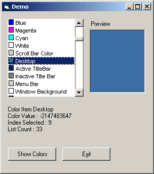



## Dev Color Selector

### Description

This is a small project I made about 20 min ago that I wanted a list of colours like in the VBs properties Box. so I made one using the line control and Bitblt. very easy to use. I also make it into an ActiveX control. anyway please vote if you find this usfull.
 
### More Info
 

             |
---                |---
**Submitted On**   |2001-10-26 03:18:14
**By**             |[dreamvb](https://github.com/Planet-Source-Code/PSCIndex/blob/master/ByAuthor/dreamvb.md)
**Level**          |Beginner
**User Rating**    |4.7 (14 globes from 3 users)
**Compatibility**  |VB 6\.0
**Category**       |[Custom Controls/ Forms/  Menus](https://github.com/Planet-Source-Code/PSCIndex/blob/master/ByCategory/custom-controls-forms-menus__1-4.md)
**World**          |[Visual Basic](https://github.com/Planet-Source-Code/PSCIndex/blob/master/ByWorld/visual-basic.md)
**Archive File**   |[Dev\_Color\_18107910262004\.zip](https://github.com/Planet-Source-Code/dreamvb-dev-color-selector__1-56952/archive/master.zip)

